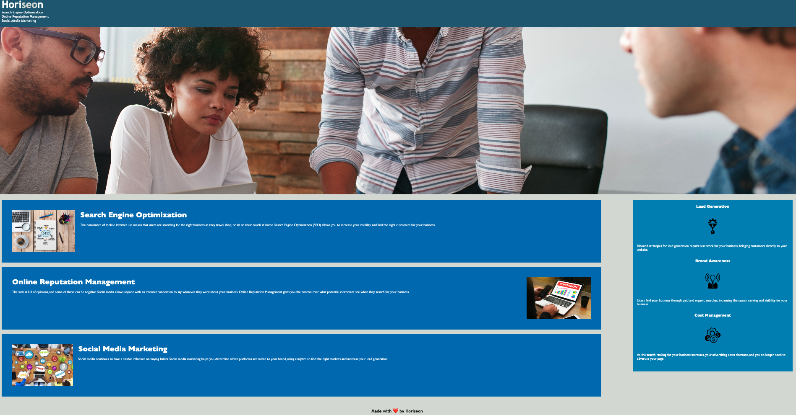

# Website Refactoring

## Table of Contents
* [Description](#Description)
* [Deployed-Link](#Deployed-Link)
* [Screenshot](#Screenshot)
* [Technologies](#Technologies)
* [Features](#Features)
* [Usage](#Usage)
* [Learning Points](#Learning-points)
* [Author Information](#Author-information)

## Description

I reduced redundancy in stylesheet and optimized semantic html layout.

## Deployed Link

[Visit the deployed site](https://justhenner.github.io/Horiseon-Digital-Marketing-Strategy-Microsite-Optimization/)

## Screenshot

## Technologies

| Technology Used         | Resource URL           |
| ------------- |:-------------:|
| Git | [https://git-scm.com/](https://git-scm.com/)     |
| HTML    | [https://developer.mozilla.org/en-US/docs/Web/HTML](https://developer.mozilla.org/en-US/docs/Web/HTML) |
| CSS     | [https://developer.mozilla.org/en-US/docs/Web/CSS](https://developer.mozilla.org/en-US/docs/Web/CSS)      |

## Features

- Users can navigate the website by clicking links in the navigation bar.

## Usage 

Go to [my GitHub repo](https://github.com/justhenner/Horiseon-Digital-Marketing-Strategy-Microsite-Optimization) to clone the repo.

## Learning Points

- Semantic elements enhance html readability. 
- Consolidating stylesheet reduces redundancy.
- Working hyperlinks ensure positive user experience.

## Author Information

### Henner Espinoza 
* [Email](henner.espinoza@gmail.com)
* [LinkedIn](https://www.linkedin.com/in/hennerespinoza/) 
* [GitHub](https://github.com/justhenner)
